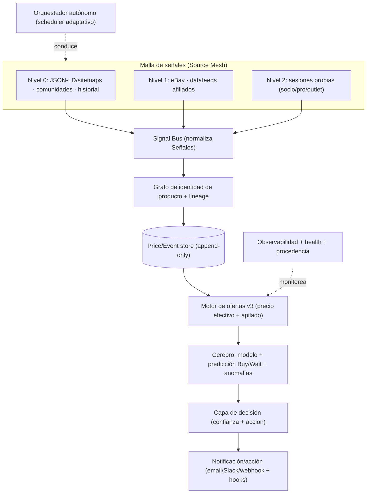

# Arquitectura del motor autónomo de inteligencia de ofertas

> Documento de diseño (norte del proyecto). Reencuadra el sistema de "comparador
> de precios" a **agente autónomo de inteligencia de ofertas** de alcance máximo,
> profesional y capaz de operar en las **zonas grises legítimas** del descuento.
> No requiere acceso público: corre privado para una sola empresa.

---

## 0. Principio rector

**No buscamos "el precio más bajo hoy". Buscamos el mismo artículo al mínimo
costo efectivo real, en el momento correcto, por cualquier vía legítima —
incluidas las que casi nadie explota.**

Tres criterios gobiernan cada decisión del motor:

1. **Alcance máximo** — muchas señales legítimas, no una sola API con gate.
2. **Profesionalismo** — cada alerta trae evidencia, confianza y una acción
   concreta; nada de falsos positivos ruidosos.
3. **Pensar out-of-the-box** — modelar el comportamiento del precio y explotar
   mecánicas de descuento infrautilizadas (las "zonas grises").

### Qué es "zona gris" legítima (y qué NO)
| ✅ SÍ (infrautilizado pero legítimo) | ❌ NO (fuera de alcance, siempre) |
|---|---|
| Outlet / open-box / refurbished / warehouse oficiales | Evadir CAPTCHAs o controles anti-bot |
| Modelo de temporada anterior (mismo artículo, −40/60%) | Scrapear violando ToS o robots.txt |
| Apilar cupón + oferta + cashback + gift-card | Usar sesiones/cuentas ajenas |
| Price-match y ajuste de precio post-compra | Falsear identidad para eludir bloqueos |
| Pro-deals / programas de compra profesional | Revender datos licenciados de terceros |
| Arbitraje regional / de moneda (costo aterrizado) | Comprar mercadería robada/falsificada |
| Señales de comunidades (deals reportados por humanos) | — |
| Detección de errores de precio (price mistakes) | — |

Como el motor es **privado**, puede además operar **autenticado en las cuentas
de la propia empresa** (precios de socio/pro, liquidaciones logueadas). Eso es
legítimo — es tu cuenta, tu dato — siempre respetando los ToS de cada sitio.

---

## 1. Alcance máximo — arquitectura de "malla de señales" (Source Mesh)

La idea clave: **el alcance viene del ancho de señales, no de la profundidad de
una API.** En vez de depender de 2-3 APIs grandes (con gates y hasta cerradas —
Amazon PA-API se retiró en 2026), se teje una malla de fuentes por nivel de
fricción, todas emitiendo una **Señal** normalizada al mismo bus.

**Niveles de fuente**
- **Nivel 0 — libre e inmediato (legal):**
  - **Datos estructurados públicos**: JSON-LD/schema.org que los retailers
    publican en sus páginas para SEO (precio, disponibilidad, GTIN), sitemaps
    XML, feeds RSS/Atom de "sale".
  - **Comunidades de ofertas** (señal humana, como los cupones crowdsourced de
    Honey): Slickdeals/DealNews (RSS), Reddit JSON (r/ULgeartrade, r/GearTrade,
    subreddits de marca), foros outdoor. Alta señal, cero costo.
  - **Servicios de historial** de precio con alertas públicas (p. ej. RSS de
    caídas de precio).
- **Nivel 1 — gratis con aprobación:** eBay (Partner + Browse API), **datafeeds
  de afiliados** (AvantLink/Impact/CJ) — el gran multiplicador de cobertura real.
- **Nivel 2 — autenticado y privado (ventaja del motor privado):** portales de
  socio/pro, outlets logueados, price-match tools. Automatización de navegador
  (Playwright) conduciendo **las propias cuentas de la empresa**.

**Componentes**
- `Connector` uniforme (ya existe) + *capabilities* declaradas
  (`provides_price`, `provides_coupons`, `provides_stock`, `needs_auth`,
  `provides_history`, `is_outlet`, `is_human_signal`).
- **Signal Bus**: normaliza señales heterogéneas (oferta, cupón, evento de
  precio, reporte humano, evento de stock) a un modelo común.
- **Trust/health por fuente**: cada fuente tiene confiabilidad y salud; el motor
  pondera y auto-desactiva las caídas (§6).

---

## 2. Catálogo de "ingenios" — mecánicas de zona gris

Esto es el corazón del pedido. Cada mecánica es una fuente o un modificador de
precio de primera clase:

1. **Canales outlet/refurb oficiales** — Patagonia Worn Wear, Arc'teryx ReGEAR,
   REI Re/Supply, TNF Renewed, Backcountry "Last Chance", Steep&Cheap. El mismo
   watch item "nuevo" mapea a sus equivalentes outlet/refurb.
2. **Linaje de modelo (temporada anterior)** — el mismo artículo funcional del
   año pasado suele estar −40/60%. El motor mantiene **lineage de SKU**
   (Beta AR '23 ↔ '24) para que una oferta del colorway viejo cuente.
3. **Clearance de talla/color "huérfano"** — los retailers rematan las últimas
   tallas; el motor caza específicamente *tu* talla donde quedó huérfana.
4. **Apilado de cupón/promo** — ingiere códigos activos (feeds crowdsourced),
   calcula el **precio post-cupón** y detecta combos apilables.
5. **Cashback / portales** — Rakuten/TopCashback/ofertas de tarjeta suman 2-12%
   al descuento efectivo.
6. **Arbitraje de gift-card** — gift cards de retailer con 8-12% off en mercados
   secundarios reducen el costo efectivo.
7. **Arbitraje regional / de moneda** — mismo producto más barato en otra
   región/tienda regional de la marca, considerando **envío + aranceles**
   (costo aterrizado, no sticker).
8. **Detección de errores de precio (price mistakes)** — caídas anómalas
   (nuestro tier "suspect") a veces son errores reales; un motor privado los
   marca para **acción humana rápida** (se corrigen en minutos).
9. **Ajuste de precio / price-match** — muchos retailers devuelven la diferencia
   si baja dentro de N días, o igualan a la competencia. El motor convierte
   detección en **dinero recuperado incluso post-compra**.
10. **Pro-deals / programas profesionales** — ExpertVoice y portales pro de
    marca dan 30-50% a perfiles que califican (guías, etc.). Fuente autenticada.
11. **Timing de lealtad** — ventanas de cupón de socio REI + dividendo; ciclos
    conocidos.
12. **Descomposición de bundles** — a veces el pack sale más barato que el ítem
    suelto; detectarlo.
13. **Señal de escasez / back-in-stock** — clearance se agota rápido: polling de
    baja latencia en SKUs vigilados.
14. **Nota de mercado gris "autorizado vs no"** — distinguir distribuidor
    internacional autorizado (ok) de no autorizado (riesgo de garantía) y
    **marcar el riesgo** para que la compra sea informada.

---

## 3. El "precio efectivo" (costo aterrizado) — métrica unificadora

La mayoría de las herramientas comparan **precio de sticker**. El diferencial
out-of-the-box es comparar el **costo efectivo aterrizado**:

```
precio_efectivo =
    precio_lista
  − descuento_oferta
  − cupón_apilable
  − cashback
  − descuento_gift_card
  + envío
  + impuestos/aranceles
  − valor_recompensas (dividendo/puntos)
```

Todo se compara en `precio_efectivo` (en la moneda base). Una oferta con sticker
más alto puede ganar por apilado. El detector rankea por **descuento efectivo**,
no aparente.

---

## 4. El cerebro — modelado, predicción y decisión

Pasar de "encontré un descuento ≥ X%" a **"comprá / esperá / mantené"** con
confianza:

- **Modelo por producto**: distribución de precios, frecuencia de rebaja,
  profundidad típica y **ciclo estacional** (ya iniciado). Aprende el
  comportamiento de *cada* SKU.
- **Predicción Buy/Wait/Hold**: "esta campera toca fondo ~−55% a fin de julio;
  el −30% de hoy es bueno-no-óptimo → esperar" vs "comprá ya, no baja más".
- **Percentil de profundidad dentro de su propia historia**: "este es el
  descuento en el percentil 92 jamás visto para este ítem".
- **Elasticidad cross-retailer**: cuando uno baja, los demás siguen en días →
  anticipar la caída.
- **Señal de demanda/escasez**: poco stock + alta deseabilidad → comprar ya.
- **Detección de anomalías** para errores de precio (aislar de la varianza
  normal).
- **Confianza + procedencia**: cada recomendación lleva su nivel de confianza y
  la **cadena de evidencia** (qué señales, qué certeza de match).

---

## 5. Grafo de identidad de producto (resolver "el mismo artículo")

El problema difícil que habilita todo lo anterior: agrupar listings de muchas
fuentes en **un producto canónico** con sus variantes y predecesores.

- **UPC/GTIN primero**: identidad dura cuando existe.
- **Fuzzy + marca canónica** (ya lo tenemos) para el resto.
- **Lineage de modelo**: enlazar temporada anterior / colorways / refurb / outlet
  al mismo nodo canónico.
- Resultado: una oferta en *cualquier* canal (nuevo, outlet, refurb, viejo,
  regional) resuelve al mismo producto y compite en `precio_efectivo`.

---

## 6. Autonomía y robustez (el motor "autónomo")

- **Scheduler adaptativo**: cadencia por temperatura del ítem — SKUs de clearance
  / hot se sondean seguido; fríos, rara vez; y **más frecuencia fuera de
  temporada** (invierno en primavera/verano).
- **Auto-tuning**: umbrales/percentiles se calibran solos por
  producto/categoría según resultados.
- **Circuit breakers + health por fuente**: sobre la capa HTTP resiliente (ya
  existe reintentos/backoff/rate-limit) — breaker que desactiva y reactiva
  fuentes caídas.
- **Feedback loop (aprendizaje)**: registrar decisiones de compra y su resultado
  (¿bajó más? ¿compramos en el piso?) para mejorar el modelo.
- **Store event-sourced**: historial append-only (ya en JSONL); migrar a SQLite/
  DuckDB embebido cuando crezca, con retención/compactación.
- **Observabilidad**: `data/status.json` (última corrida, salud por fuente,
  errores), métricas, y **procedencia** auditable de cada oferta.
- **Notificación inteligente**: dedup, **digest vs urgente** (error de precio /
  clearance = urgente), horas de silencio, ruteo de canal (email/Slack/Telegram/
  webhook) y **hooks de acción** (link con cupón pre-aplicado / borrador de orden).

---

## 7. Arquitectura integral (capas)



**Mapa a lo ya construido**: `connectors/` → Source Mesh · `normalize.py` →
identidad (extender con lineage/UPC) · `store.py` → event store · `dealdetector`
v2 → motor v3 · `seasons.py` → cerebro estacional · `http.py` → añadir breaker ·
nuevo `status.json` → observabilidad · `notify/` → multicanal.

---

## 8. Guardarraíles (para que "gris" siga siendo legítimo)

- Respetar ToS y `robots.txt`; **retirarse** ante bloqueos/CAPTCHA (nunca
  evadir).
- Preferir feeds oficiales, APIs y datos estructurados públicos.
- Sesiones autenticadas **solo** en cuentas propias de la empresa.
- Identificarse, limitar el ritmo, cachear; no martillar.
- Marcar riesgo de garantía / mercado gris no autorizado para compra informada.
- No redistribuir públicamente datos licenciados (motor privado = ok para uso
  interno).

---

## 9. Roadmap por leverage (todo sin nuevas APIs)

Orden sugerido, de mayor impacto y menor costo hacia lo más ambicioso:

1. **Precio efectivo + apilado (cupón/cashback/gift-card/envío/impuestos)** —
   convierte el detector v2 en v3. Alto impacto, pura lógica.
2. **Grafo de identidad + lineage de modelo** — habilita outlet/refurb/temporada
   anterior. El multiplicador de alcance.
3. **Fuentes Nivel 0 sin gate**: parser de **JSON-LD/schema.org** + ingestión de
   **señales de comunidad** (RSS/Reddit JSON) con matching a la watchlist.
4. **Cerebro Buy/Wait/Hold + percentil histórico + anomalías** — la inteligencia.
5. **Autonomía**: scheduler adaptativo + circuit breakers + `status.json`
   (observabilidad) + auto-tuning.
6. **Notificación multicanal + digest/urgente + hooks de acción**.
7. **Feedback loop** (registrar resultados de compra y aprender).
8. **(Cuando haya cuentas)** activar Nivel 1/2: eBay, afiliados, sesiones pro.

Cada fase es testeable offline con fixtures realistas antes de tocar una sola
credencial.
